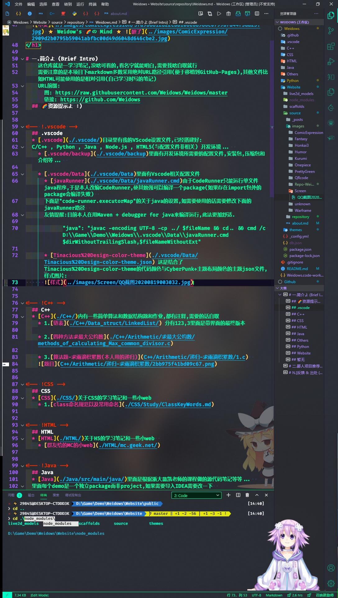

<!--
 *                        _oo0oo_
 *                       o8888888o
 *                       88" . "88
 *                       (| -_- |)
 *                       0\  =  /0
 *                     ___/`---'\___
 *                   .' \\|     |// '.
 *                  / \\|||  :  |||// \
 *                 / _||||| -:- |||||- \
 *                |   | \\\  - /// |   |
 *                | \_|  ''\---/''  |_/ |
 *                \  .-\__  '-'  ___/-. /
 *              ___'. .'  /--.--\  `. .'___
 *           ."" '<  `.___\_<|>_/___.' >' "".
 *          | | :  `- \`.;`\ _ /`;.`/ - ` : | |
 *          \  \ `_.   \_ __\ /__ _/   .-` /  /
 *      =====`-.____`.___ \_____/___.-`___.-'=====
 *                        `=---='
 *
 *
 *      ~~~~~~~~~~~~~~~~~~~~~~~~~~~~~~~~~~~~~~~~~~~
 *
 *            佛祖保佑       永不宕机     永无BUG
 *
 *        佛曰:
 *                写字楼里写字间，写字间里程序员；
 *                程序人员写程序，又拿程序换酒钱。
 *                酒醒只在网上坐，酒醉还来网下眠；
 *                酒醉酒醒日复日，网上网下年复年。
 *                但愿老死电脑间，不愿鞠躬老板前；
 *                奔驰宝马贵者趣，公交自行程序员。
 *                别人笑我忒疯癫，我笑自己命太贱；
 *                不见满街漂亮妹，哪个归得程序员？
 *
 * @Author: Weidows
 * @Date: 2020-06-06 23:12:42
 * @LastEditors: Weidows
 * @LastEditTime: 2020-08-22 15:26:23
 * @FilePath: \Weidows\Website\source\repository\Weidows.md
 -->
<h1 align="center">

   ⭐️ Weidow's 🌈の Mind ⭐️   
  [GitHub中打开](https://github.com/Weidows/Weidows)
</h1>

# 一.简介よ (Brief Intro)
    这仓库就是一学习笔记,没啥可看的,看名字就能明白,需要找啥自取就行
    需要注意的是本项目下markdown多数采用绝对URL路径引用(便于移植到GitHub-Pages),其他文件比如HTML可能使用的是相对引用(自己学习时写的笔记)
    URL前缀:
      图: https://raw.githubusercontent.com/Weidows/Weidows/master
      链接: https://github.com/Weidows/Weidows/tree/master
  ## 🌈资源提示よ :)

<!-- !.vscode -->
  ## .vscode
  * [.vscode](https://github.com/Weidows/Weidows/tree/master/.vscode/)目录里有我的VScode设置文件,已经搭建好:
  https://github.com/Weidows/Weidows/tree/master/C++ , Python , Java , Node.js , HTML5(与配置文件非相关) 开发环境...  
    * [.vscode/backup](https://github.com/Weidows/Weidows/tree/master/.vscode/backup)里面有开发环境所需要的配置文件,安装包,压缩包和介绍等...  
  
    * [.vscode/Data](https://github.com/Weidows/Weidows/tree/master/.vscode/Data)里面有Vscode相关配置文件
      * [javaRunner](https://github.com/Weidows/Weidows/tree/master/.vscode/Data/javaRunner.cmd)由于CodeRunner只能运行单文件java程序,于是本人改编CodeRunner,使其勉强可以编译一个package(如果存在import包外的package会编译失败)  
      下面是"code-runner.executorMap"的关于java的设置,如需要使用的话需要修改下面的javaRunner路径  
      友情提醒:目前本人在用Maven + debugger for java来编译运行,此法更加舒适.

            "java": "javac -encoding UTF-8 -cp ../ $fileName && cd.. && cmd /c D:\\Game\\Demo\\Weidows\\.vscode\\Data\\javaRunner.cmd $dirWithoutTrailingSlash,$fileNameWithoutExt"

      * [Tinacious%20Design-color-theme](https://github.com/Weidows/Weidows/tree/master/.vscode/Data/Tinacious%20Design-color-theme.json) 这是结合了Tinacious%20Design-color-theme的代码颜色与CyberPunk+主题布局颜色的主题json文件,样式图片:  
      

<!-- !C++ -->
  ## C++
  * [C++](https://github.com/Weidows/Weidows/tree/master/C++/)内有一些简单算法和数据结构题和作业,都有注释,需要的话自取
    * 1.[链表](https://github.com/Weidows/Weidows/tree/master/C++/Data_struct/LinkedList/) 分有123,3里面是带界面的最终版本
  
    * 2.[四种方法求最大公约数](https://github.com/Weidows/Weidows/tree/master/C++/Arithmetic/求最大公约数/methods_of_calculating_Max_common_divisor.c)

    * 3.[算法题-求雨滴积累数(本人用的递归)](https://github.com/Weidows/Weidows/tree/master/C++/Arithmetic/递归-求雨滴积累数/1.c)  
    

<!-- !CSS -->
  ## CSS
  * [CSS](https://github.com/Weidows/Weidows/tree/master/CSS/)关于CSS的学习笔记和一些小web  
    * 1.[class命名规范以及常用命名](https://github.com/Weidows/Weidows/tree/master/CSS/Study/KeyPoints/ClassKeyWords.md)

<!-- !HTML -->
  ## HTML
  * [HTML](https://github.com/Weidows/Weidows/tree/master/HTML/)关于H5的学习笔记和一些小web  
    * [群友给的MC的小web](https://github.com/Weidows/Weidows/tree/master/HTML/mc.geek.net/)

<!-- !Java -->
  ## Java
  * [Java](https://github.com/Weidows/Weidows/tree/master/java/src/main/java/)里面是根据浙大翁凯老师的课程做的源代码笔记等等...  
  里面每个demo是一个独立package而非project,如果需要导入IDEA需要改一下  
    * 1.[狐狸与兔子源码](https://github.com/Weidows/Weidows/tree/master/java/src/main/java/twenty/july/my_interface/)/[图片](https://raw.githubusercontent.com/Weidows/Weidows/master/java/src/main/java/twenty/july/my_interface/interface/Cells173751.png)  
    这个是翁凯老师课程6.3(狐狸与兔子)的源代码内容,中国大学MOOC上没有给出,老师的讲解也不全面,网上的资源都...甚至还有10RMB出售的(大醉),此处给出送给有缘人:)  
    另外,还有[细胞自动机源码](https://github.com/Weidows/Weidows/tree/master/java/src/main/java/twenty/july/data_depart_behave/) / [下一章7.x的狐狸与兔子源码](https://github.com/Weidows/Weidows/tree/master/java/src/main/java/twenty/july/control_inversion/)  
    小小诚意,不求Star了,一起共勉!
  
    * 2.[贪吃蛇小程序-README](https://github.com/Weidows/Weidows/tree/master/java/src/main/java/demos/snake_game/README.md)  
    别人做的小程序,在此学习一下Java基础

<!-- !Others -->
  ## Others
  * [Others](https://github.com/Weidows/Weidows/tree/master/Others/)目录有一些其他语言的花里胡哨...以及Markdown等文件(各种随笔 & 他人项目)  
    * 1.[VScode插件推荐](https://github.com/Weidows/Weidows/tree/master/Others/MarkDown/Vscode.md)  

    * 2.[2016年世界编程大赛状元作品(这可不是我的啊!!!)](https://github.com/Weidows/Weidows/tree/master/Others/hg_fermi-paradox-20161105)
        

<!-- !Python -->
  ## Python
  * [Python](https://github.com/Weidows/Weidows/tree/master/Python/)  
    * 1.目录里面有个520表白(Claim Love.py)的单文件源码,作者是别人(开源了),在此给路人行个方便...

<!-- !Website -->
  ## Website
  * [Website](https://github.com/Weidows/Weidows/tree/master/Website/)这里面是GitHub-Pages页面搭建环境,部署在本仓库gh-pages分支里

  * [Website/source](https://github.com/Weidows/Weidows/tree/master/Website/source/)这里面是搭建网站所用到的markdown文章和图片

    * [Website/source/images](https://github.com/Weidows/Weidows/tree/master/Website/source/images/)这里面是本仓库所用到的所有图片(markdown引用到的和网站内所用到的)  
    里面有横/竖屏 **涩图** (狗头,用来做VScode超越鼓励师URL图),目前整理有:  
      绿色植物(PrettyGreen) , 崩坏三(Honkai3) , 星际战甲(Warframe) , 狂三(Kurumi) , 海贼王(Onepiece) , 表情包 , unknown 等等...  
    PS: 2020-8-18弃用VScode超越鼓励师换用另一个"超级鼓励师",但保留原有image及其路径 && 备用链接

  
<!-- !暂无 -->
  ## 暂无
    * 暂无其他  loading...

# 二.鄙人项目推荐よ (To Be Star != 2B Star:)
  * [VScode彩虹屁-相声语音包](https://github.com/Weidows/Crosstalk-rainbow-fart)

  * 尚未立项:
    * [VScode插件推荐](https://github.com/Weidows/Weidows/tree/master/Others/MarkDown/Vscode.md)
    * 
  * 暂无其他  loading...

# N.[反馈 & 出处 (Aboue me & Click me)](https://Weidows.github.io/Weidows/about)

  *如果哪里有纰漏请在评论指正,欢迎讨论*

  